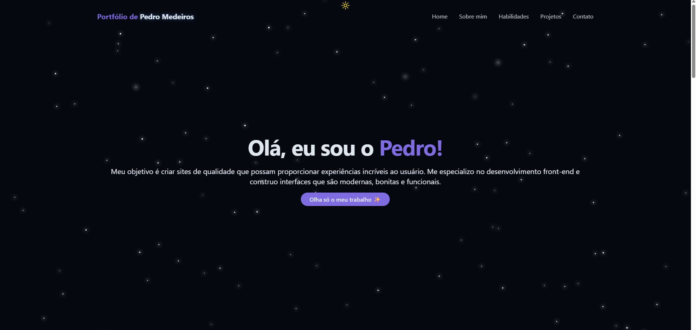
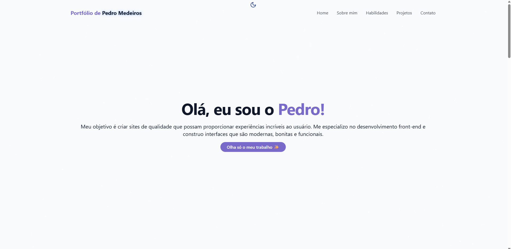
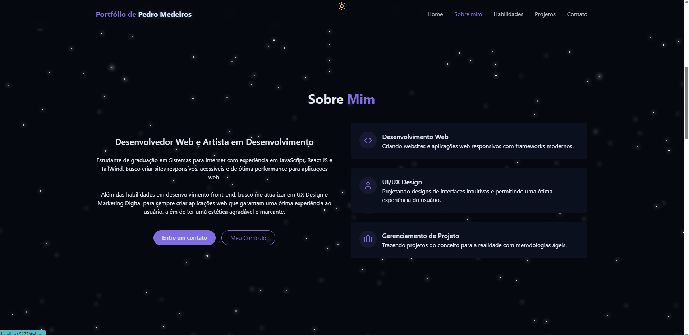
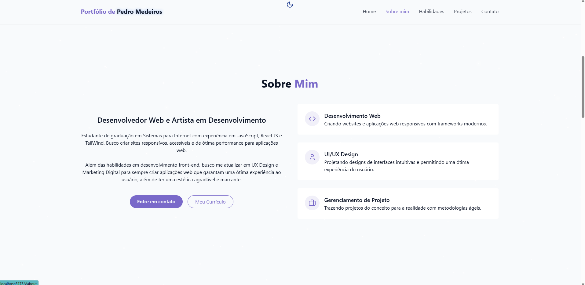
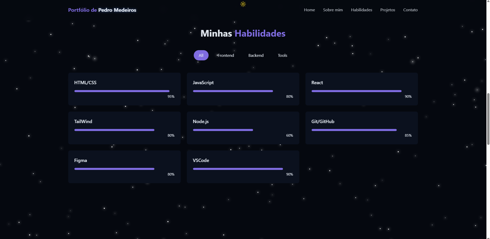
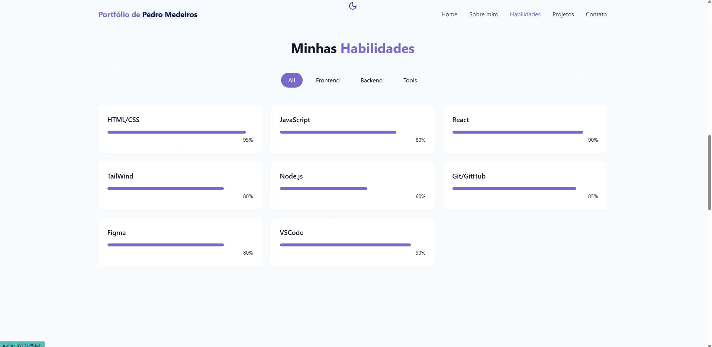
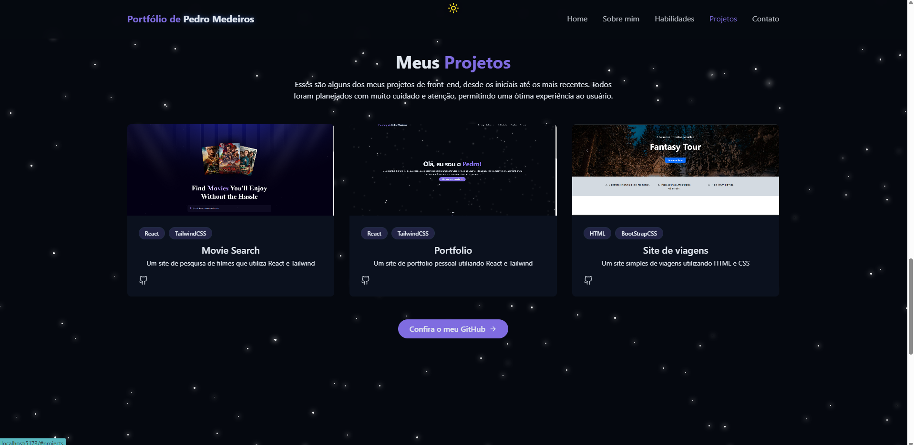
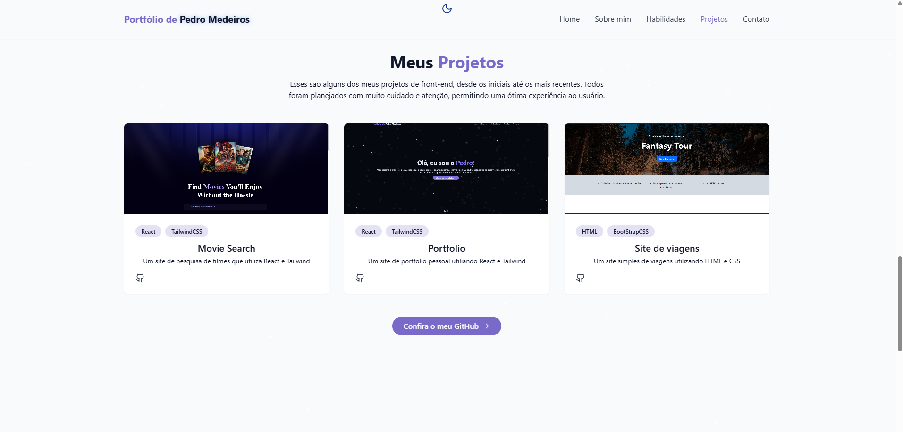
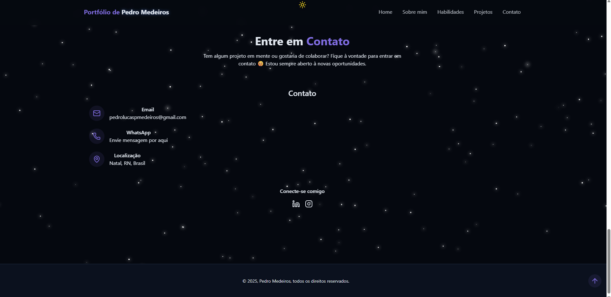
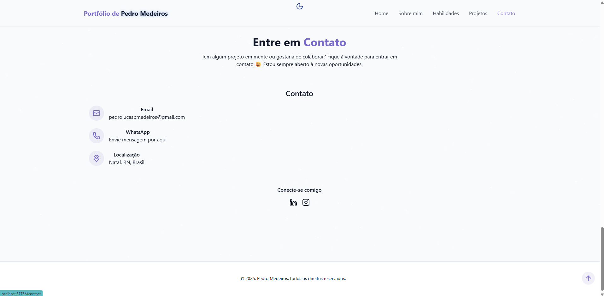

Criador: Pedro Lucas Pereira de Medeiros

Projeto de Portfólio com tema espacial para desenvolvedor Web. Esse é o meu projeto principal de portfólio, que utiliza de React.JS e Tailwind como tecnologias principais para o seu desenvolvimento.

Nele, há algumas seções principais para me conhecer melhor, desde sobre alguns fatos sobre mim, até minhas habilidades como desenvolvedor e alguns projetos de front-end. Ao final da página você também pode encontrar formas de entrar em contato comigo, para que possamos, quem sabe, colaborar juntos em algum projeto. 

A seguir, você poderá ver algumas imagens do meu site, assim como o link para o mesmo.

Link: https://vercel.com/pedro-medeiros-projects-f2440013/portfolio-react/GXSjAZXqPsYvNMAyt3i6gV67AudF

Intro do site: 

Seção sobre mim:

Seção sobre minhas habilidades:

Seção sobre alguns dos meus projetos:

Entre em contato comigo:

